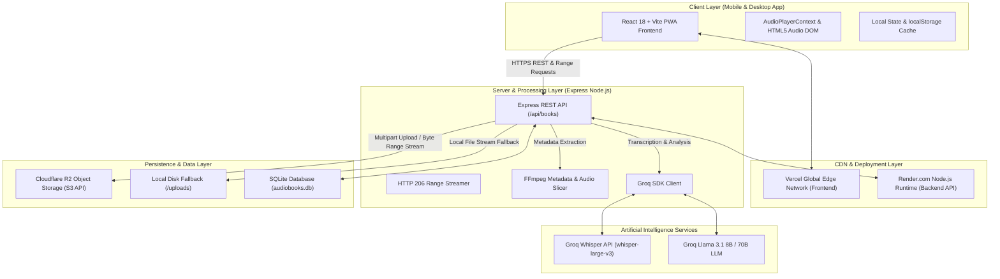

# 🎧 MyAudioBook Architecture Specification

A modern, full-stack, cloud-native AI Audiobook Streaming & Chapter Management Web Application built with React, Express, Cloudflare R2 Object Storage, Groq AI, SQLite, and FFmpeg.

---

## 🏗 High-Level System Architecture



---

## 🛠 Technology Stack

| Layer | Technologies Used |
|---|---|
| **Frontend Framework** | React 18, Vite 6, TypeScript, Tailwind CSS, Lucide Icons |
| **Backend Runtime** | Node.js (ES Modules), Express.js, TypeScript |
| **Cloud Object Storage** | Cloudflare R2 Object Storage (`@aws-sdk/client-s3`, `@aws-sdk/lib-storage`) |
| **Artificial Intelligence** | Groq SDK (`whisper-large-v3` for speech transcription, `llama-3.1-8b-instant` / `llama3-70b-8192` for chapter timestamp extraction) |
| **Audio Processing** | FFmpeg Static, FFprobe (`fluent-ffmpeg`) |
| **Database** | SQLite (`sql.js`) with persistent disk storage (`server/data/audiobooks.db`) |
| **Deployment** | Vercel (Frontend CDN), Render / Railway (Node Backend) |

---

## 🔄 Core Data & Execution Flows

### 1. Audiobook Upload & Storage Pipeline
1. **Frontend Form Submission**: The user uploads an MP3 file (up to 1GB+) and an optional cover image.
2. **Local Temp Buffering**: Express Multer buffers the incoming upload in `./temp`.
3. **Audio Metadata Probe**: FFmpeg inspects the file to extract duration, bitrate, and sample rate.
4. **Cloudflare R2 Multipart Stream**: `@aws-sdk/lib-storage` streams the file in 10MB parts directly to Cloudflare R2 (`audiobooks/book-{id}/audio-...`). A copy is also saved to `./uploads` for offline/local fallback.
5. **Chapter Extraction**:
   - **Mode A: Single Timestamp Description (Groq AI)**: The user pastes a text description containing timestamps (`00:00 Intro`, `05:30 Chapter 1`). Groq LLM parses the description into clean structured chapter JSON.
   - **Mode B: AI Audio Transcription (Groq Whisper + LLM)**: Groq Whisper transcribes the audio, and Llama LLM detects natural chapter boundaries.
   - **Mode C: Manual List**: Custom timestamps entered line-by-line.
6. **SQLite Storage**: The book record and formatted chapter timestamps are saved in `audiobooks.db`.

---

### 2. High-Performance HTTP Range Audio Streaming
```
Browser HTML5 <audio>  <--->  Express Backend Proxy  <--->  Cloudflare R2 Storage
(Sends Header: Range: bytes=0-1024)   (Streams Partial Response: 206)  (Fetches S3 Byte Range)
```

1. Browser requests audio stream via `GET /api/books/:id/audio`.
2. Browser sends HTTP `Range: bytes={start}-{end}` header.
3. Server requests the byte range from Cloudflare R2 object storage using `GetObjectCommand`.
4. Server pipes the R2 stream to the browser with headers:
   - `HTTP/1.1 206 Partial Content`
   - `Content-Range: bytes {start}-{end}/{totalSize}`
   - `Content-Type: audio/mpeg`
   - `Accept-Ranges: bytes`
5. Enables instant chapter seeking and scrub controls without downloading the full file.

---

## 🗄 Database Schema Specification

SQLite file: `server/data/audiobooks.db`

### Table: `books`
| Column Name | Type | Description |
|---|---|---|
| `id` | TEXT (PK) | Unique book identifier (`book-1787...`) |
| `title` | TEXT | Audiobook title |
| `author` | TEXT | Author name |
| `description` | TEXT | Audiobook description summary |
| `genre` | TEXT | Genre / Category |
| `language` | TEXT | Language (default: `English`) |
| `r2_audio_key` | TEXT | Cloudflare R2 S3 Key for audio stream |
| `r2_cover_key` | TEXT | Cloudflare R2 S3 Key for cover image |
| `local_file_name` | TEXT | Local audio file fallback path in `./uploads` |
| `local_cover_name` | TEXT | Local cover image fallback path in `./uploads` |
| `file_size` | INTEGER | File size in bytes |
| `duration_seconds` | REAL | Total audio duration in seconds |
| `processing_status` | TEXT | Processing state (`ready`, `processing`, `failed`) |
| `created_at` | TEXT | ISO timestamp |

### Table: `chapters`
| Column Name | Type | Description |
|---|---|---|
| `id` | TEXT (PK) | Unique chapter identifier (`ch-book-...-1`) |
| `book_id` | TEXT (FK) | Reference to `books.id` |
| `chapter_number` | INTEGER | Chapter order index (1, 2, 3...) |
| `title` | TEXT | Chapter title |
| `start_time` | REAL | Start timestamp in seconds |
| `end_time` | REAL | End timestamp in seconds |
| `duration` | REAL | Chapter duration in seconds |

### Table: `listening_progress`
| Column Name | Type | Description |
|---|---|---|
| `id` | TEXT (PK) | Progress record ID |
| `book_id` | TEXT (FK) | Reference to `books.id` |
| `chapter_id` | TEXT | Currently active chapter ID |
| `position_seconds` | REAL | Last played audio position in seconds |
| `completed` | INTEGER | `1` if completed, `0` otherwise |
| `updated_at` | TEXT | ISO timestamp |

---

## 🌐 API Reference

### Audiobooks
- `GET /api/books` - Search, filter, and list audiobooks
- `GET /api/books/:id` - Fetch single book metadata + chapters
- `POST /api/books/upload` - Upload audio/cover + run Groq AI chapter parsing
- `GET /api/books/:id/audio` - HTTP 206 Range audio streaming endpoint
- `GET /api/books/:id/cover` - Proxy cover image stream
- `PUT /api/books/:id/progress` - Save user listening position & progress
- `POST /api/books/:id/favorite` - Toggle book favorite state
- `DELETE /api/books/:id` - Delete book record and files from R2/local disk

### System & Auth
- `GET /api/health` - Check API and Cloudflare R2 status
- `GET /api/auth/me` - Fetch active user profile
- `GET /api/settings/r2-storage` - Inspect Cloudflare R2 bucket connection

---

## 🚀 Production Deployment Topology

```
+-------------------------------------------------------------+
|                      USER (Browser / Phone)                 |
+-------------------------------------------------------------+
                               |
               +---------------+---------------+
               |                               |
               v                               v
+-------------------------------+ +-------------------------------+
|  Vercel Frontend (React SPA)  | | Render Backend (Express API)  |
|  - Host: myaudiobook.vercel.app| | - Host: api.onrender.com      |
|  - Serves UI assets & PWA     | | - Handles R2 & Groq AI calls|
+-------------------------------+ +-------------------------------+
                                               |
                                               v
                                  +--------------------------+
                                  | Cloudflare R2 Bucket     |
                                  | myaudiobook-storage      |
                                  +--------------------------+
```
