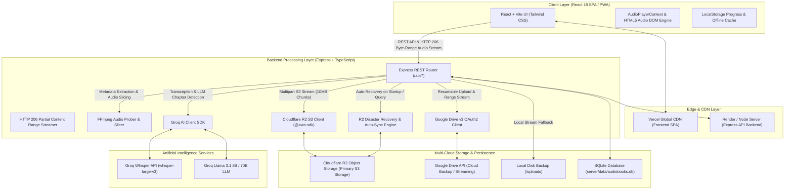
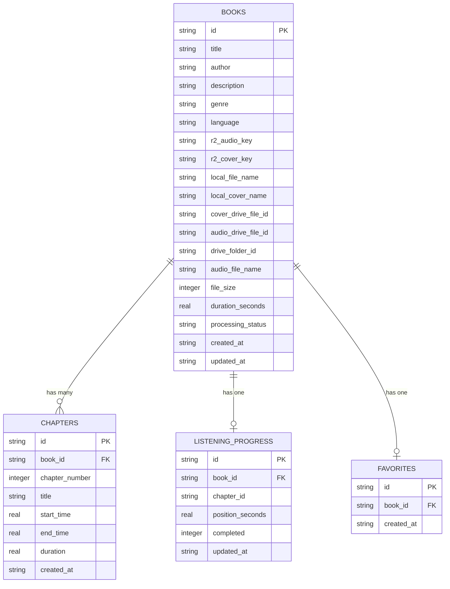

# 🎧 MyAudioBook — Comprehensive System Architecture Specification

**MyAudioBook** is a full-stack, cloud-native AI Audiobook Streaming & Chapter Management Web Application built with **React 18**, **Vite**, **TypeScript**, **Express (Node.js)**, **Cloudflare R2 Object Storage (S3 API)**, **Google Drive OAuth2 API**, **Groq AI (Whisper & Llama 3.1)**, **SQLite (`sql.js`)**, and **FFmpeg**.

---

## 🏛 1. High-Level System Architecture



---

## 🛠 2. Technology Stack & Key Dependencies

| Architectural Layer | Key Technologies & Libraries Used |
|---|---|
| **Frontend Framework** | **React 18.3**, **Vite 6.1**, **TypeScript 5.7**, **React Router DOM 7.1** |
| **UI & Styling** | **Tailwind CSS 3.4**, **Lucide React Icons**, **clsx**, **tailwind-merge** |
| **Backend Runtime** | **Node.js (ES Modules)**, **Express.js 4.21**, **TypeScript (`tsx`)**, **Cors**, **Multer** |
| **Primary Cloud Storage** | **Cloudflare R2 Object Storage** via `@aws-sdk/client-s3`, `@aws-sdk/lib-storage`, `@aws-sdk/s3-request-presigner` |
| **Secondary Cloud Storage** | **Google Drive v3 API** via `googleapis` (OAuth2 resumable uploads & range streaming) |
| **Local Storage Fallback** | Local filesystem disk stream (`/uploads` & `/temp` directories) |
| **Artificial Intelligence** | **Groq SDK 0.15** (`whisper-large-v3` for speech transcription, `llama-3.1-8b-instant` & `llama3-70b-8192` for structured chapter JSON parsing) |
| **Audio Processing** | **FFmpeg Static 5.2**, **FFprobe Installer 2.1**, **fluent-ffmpeg 2.1** |
| **Database & Persistence** | **SQLite** via `sql.js 1.14` with binary file persistence (`server/data/audiobooks.db`) |
| **Deployment Targets** | **Vercel** (Frontend SPA), **Render / Railway / Docker** (Express Node Server) |

---

## 📂 3. Directory & Codebase Architecture

```
MyAudioBook/
├── server/                        # Express Node.js Backend API
│   ├── data/                      # Persistent SQLite Database storage
│   │   └── audiobooks.db          # sql.js exported binary database
│   ├── db/
│   │   └── database.ts            # SQLite table definitions, queries, migrations & JSON export
│   ├── routes/
│   │   ├── auth.ts                # Auth & user endpoints
│   │   └── books.ts               # Audiobook CRUD, upload, streaming, chapters & favorite APIs
│   ├── services/
│   │   ├── drive.ts               # Google Drive OAuth2 integration & resumable upload/streaming
│   │   ├── ffmpeg.ts              # Audio metadata extraction (duration, bitrate, format) & slicing
│   │   ├── groq.ts                # Groq AI Whisper transcription & Llama LLM chapter detection
│   │   └── r2.ts                  # Cloudflare R2 multipart upload, presigned URLs, streaming & auto-sync
│   └── index.ts                   # Express server entrypoint & startup initialization
├── src/                           # React 18 Frontend Application
│   ├── components/                # Modular React UI Components
│   │   ├── AudioPlayer/           # Persistent Player, Seek Bar, Volume Control, Chapter Overlay
│   │   ├── BookCard/              # Grid/List Audiobook Cards
│   │   ├── ChapterList/           # Chapter Timeline & Navigation
│   │   ├── Navigation/            # Desktop Sidebar, Mobile Header & Bottom Navigation
│   │   └── Upload/                # Multi-step Audiobook Upload Form & AI parser selector
│   ├── context/
│   │   ├── AudioPlayerContext.tsx # Central Audio Engine state, HTML5 <audio> DOM binding & progress sync
│   │   └── AuthContext.tsx        # User authentication & session provider
│   ├── hooks/                     # Custom React Hooks
│   ├── lib/
│   │   └── api.ts                 # Fetch API wrapper client for backend endpoints
│   ├── pages/                     # Application Page Views
│   │   ├── Home.tsx               # Dashboard view (Recently played, Continue Listening, Top picks)
│   │   ├── Library.tsx            # Full Audiobook library with search, filter, and sorting
│   │   ├── BookDetails.tsx        # Detailed Audiobook page with chapter breakdown & controls
│   │   ├── Favorites.tsx          # Saved favorite audiobooks grid
│   │   ├── UploadPage.tsx         # Upload page with Groq AI timestamp processing options
│   │   ├── Settings.tsx           # Cloudflare R2 & Google Drive storage status & database JSON export
│   │   └── AuthPage.tsx           # User login/registration view
│   ├── types/
│   │   └── audiobook.ts           # Shared TypeScript interfaces for Book, Chapter, ListeningProgress
│   ├── App.tsx                    # React Router configuration & Provider tree wrapper
│   ├── index.css                  # Global Tailwind CSS styles & modern dark-mode theme
│   └── main.tsx                   # React DOM render root
├── temp/                          # Temporary local buffer directory for incoming multipart uploads
├── uploads/                       # Permanent local audio file backup directory
├── package.json                   # Dependency list & NPM scripts
├── tsconfig.json                  # TypeScript configuration
├── tailwind.config.js             # Tailwind CSS theme configuration
├── vite.config.ts                 # Vite frontend dev server & build config
├── vercel.json                    # Vercel deployment configuration
└── ARCHITECTURE.md                # System Architecture Specification (this document)
```

---

## 🔄 4. Core System Workflows & Data Pipelines

### 4.1 Multi-Cloud File Upload & Ingestion Pipeline

```
[Browser Frontend Form]
       │
       ▼ (Multer Multipart POST /api/books/upload)
[Server ./temp Buffer]
       │
       ├───────────────────────────────────────────┐
       ▼                                           ▼
[FFmpeg Metadata Probe]                    [Local Backup]
(Extracts total duration, bitrate, etc.)   (Copies to ./uploads)
       │
       ├───────────────────────────────────────────┐
       ▼                                           ▼
[Cloudflare R2 Object Storage]             [Google Drive API]
(@aws-sdk/lib-storage 10MB chunks)         (OAuth2 Resumable Stream)
       │                                           │
       └─────────────────────┬─────────────────────┘
                             ▼
              [Groq AI Chapter Extraction]
                             │
                             ▼
             [SQLite DB Record Insertion]
             (audiobooks.db + R2 Metadata)
```

1. **Client Upload**: The user uploads an MP3 file (up to 1GB+) and an optional cover image via `POST /api/books/upload`.
2. **Temp Disk Buffering**: Express `multer` streams the incoming upload into the local `./temp` directory.
3. **FFmpeg Metadata Inspection**: `ffprobe` analyzes the audio file to obtain exact duration, channel counts, sample rate, and bitrates.
4. **Local Fallback Copy**: A copy is saved to `./uploads/` to guarantee offline/local playback fallback.
5. **Cloudflare R2 Storage**: `@aws-sdk/lib-storage` streams the audio file to Cloudflare R2 in 10MB chunks (`audiobooks/{bookId}/audio-...`).
6. **Google Drive Storage (Optional)**: If configured, the file is uploaded to an `Audiobooks/{BookTitle}` directory in Google Drive using resumable chunk uploads.
7. **Chapter Detection Pipeline** (see Section 4.2).
8. **Cloud & Database Sync**: Metadata and formatted chapter timestamps are saved in SQLite (`audiobooks.db`) and pushed to R2 as `audiobooks/{bookId}/chapters.json`.

---

### 4.2 Intelligent AI Chapter Detection (3 Modes)

| Mode | Input Provided | Execution Mechanism | Fallback Behavior |
|---|---|---|---|
| **Mode A: Description Parsing (Groq AI)** | Raw text description containing timestamps (e.g. `00:00 Intro`, `05:30 Chapter 1`) | Passed to Groq LLM (`llama-3.1-8b-instant` / `llama3-70b-8192`) with JSON response mode formatting. | If Groq is unavailable, automatically falls back to a smart regex parser (`parseTimestampDescriptionRegex`). |
| **Mode B: AI Audio Transcription (Groq Whisper + LLM)** | Audio MP3 file | For files >25MB (Groq API limit), FFmpeg extracts a 10-minute audio sample. Sent to Groq Whisper (`whisper-large-v3`) for transcription, then Llama 3.1 analyzes timestamps for chapter transitions. | Generates evenly distributed time chunks across total duration if transcript has no markers. |
| **Mode C: Manual Input** | Custom timestamp JSON string | Directly validated and converted into chapter timestamps. | Formats whole audio into a single default chapter if input is empty. |

---

### 4.3 High-Performance HTTP 206 Range Audio Streaming Proxy

```
HTML5 Audio Element (Browser)
     │
     ▼ Sends GET /api/books/:id/audio (Header: Range: bytes=1048576-)
Express Stream Handler (server/routes/books.ts)
     │
     ├── 1. Check if Cloudflare R2 is configured
     │      └─► Stream S3 Byte Range via GetObjectCommand (HTTP 206 Partial Content)
     │
     ├── 2. Check if Google Drive is configured
     │      └─► Stream Drive API Byte Range via OAuth2 Client (HTTP 206 Partial Content)
     │
     └── 3. Local Disk Fallback
            └─► Stream byte range from ./uploads/ using fs.createReadStream
```

- Enables **instant seeking**, scrub controls, and playback buffering without requiring full file download.
- Emits proper stream headers:
  - `HTTP/1.1 206 Partial Content`
  - `Content-Range: bytes {start}-{end}/{totalSize}`
  - `Content-Type: audio/mpeg`
  - `Accept-Ranges: bytes`
  - `Cache-Control: public, max-age=31536000, immutable`

---

### 4.4 Automated Disaster Recovery & Cloudflare R2 Auto-Sync Engine

When the backend starts up or when `/api/books` is requested on a clean SQLite database instance (e.g. fresh container deployment on Render or Railway):

1. **Auto-Discovery**: `syncBooksFromR2()` queries the Cloudflare R2 bucket with prefix `audiobooks/`.
2. **Metadata Recovery**: Reads `audiobooks/{bookId}/chapters.json` directly from object storage to restore book metadata, author details, total duration, and exact chapter timestamps.
3. **Progress Restoration**: Fetches `audiobooks/user_progress.json` from Cloudflare R2 to reconstruct all user listening positions.
4. **Zero Data Loss**: Ensures the application database can be entirely wiped or ephemeral while preserving full state in Cloudflare R2.

---

## 🗄 5. Database Schema Specification

Database File: `server/data/audiobooks.db` (SQLite managed via `sql.js`)



---

## 🌐 6. Complete API Reference

### 6.1 Audiobooks & Streaming Endpoints

| Method | Path | Description |
|---|---|---|
| `GET` | `/api/books` | Fetch all audiobooks (Supports `search`, `genre`, `filterBy`, `sortBy` parameters & non-blocking R2 auto-sync). |
| `GET` | `/api/books/:id` | Fetch single audiobook metadata along with ordered chapter list. |
| `POST` | `/api/books/upload` | Upload audio MP3 & cover image; triggers FFmpeg metadata extraction, R2/Drive upload, and Groq AI chapter parsing. |
| `GET` | `/api/books/:id/audio` | HTTP 206 Partial Content range stream endpoint for HTML5 audio player. |
| `GET` | `/api/books/:id/cover` | Image proxy endpoint serving audiobook cover art from Cloudflare R2, Google Drive, or local storage. |
| `PUT` | `/api/books/:id/progress` | Update user listening progress position and completion state. Syncs locally and to Cloudflare R2 `user_progress.json`. |
| `POST` | `/api/books/:id/favorite` | Toggle audiobook favorite state. |
| `DELETE` | `/api/books/:id` | Delete audiobook record, chapters, listening progress, and files from R2, Google Drive, and local disk. |

### 6.2 System, Storage & Administration

| Method | Path | Description |
|---|---|---|
| `GET` | `/api/health` | Healthcheck endpoint returning server timestamp, Groq AI configuration, and Cloudflare R2 connection status. |
| `GET` | `/api/settings/r2-storage` | Inspect Cloudflare R2 bucket connection and storage status. |
| `GET` | `/api/settings/drive-storage` | Inspect Google Drive OAuth2 connection, quota usage, and low-storage warnings. |
| `POST` | `/api/settings/r2-sync` | Manually trigger full Cloudflare R2 database recovery & sync. |
| `GET` | `/api/export-db` | Download full database dump in JSON format for offline backup. |
| `GET` | `/api/auth/me` | Retrieve active user authentication profile. |

---

## 💻 7. Frontend Architecture & Audio Player Engine

### 7.1 State Management (`AudioPlayerContext.tsx`)
- **Centralized HTML5 Audio DOM Element**: Manages a hidden `<audio>` element bound to React state.
- **Cross-Device Position Syncing**: Automatically picks the maximum valid playback timestamp between local `localStorage` cache and server API database record.
- **Auto-Chapter Detection & Auto-Advance**: Monitors `timeupdate` events to highlight active chapters in real-time and auto-advances to the next chapter upon completion.
- **Playback Controls**: Play, pause, skip (+30s / -15s), speed selection (0.5x, 0.75x, 1x, 1.25x, 1.5x, 1.75x, 2x), volume control, and time display mode toggle (`chapter` remaining vs `book` total).
- **Periodic Sync**: Automatically posts listening position to Express backend every 5 seconds during active playback.

---

## 🔒 8. Security & Environment Configuration

The application requires the following environment variables (defined in `.env`):

```env
# Server Runtime
PORT=3001

# Cloudflare R2 Object Storage (Primary Cloud)
CLOUDFLARE_R2_ACCOUNT_ID=your_cloudflare_account_id
CLOUDFLARE_R2_ACCESS_KEY_ID=your_r2_access_key_id
CLOUDFLARE_R2_SECRET_ACCESS_KEY=your_r2_secret_access_key
CLOUDFLARE_R2_BUCKET_NAME=myaudiobook-storage

# Groq AI Service API (Whisper + Llama 3.1)
GROQ_API_KEY=gsk_your_groq_api_key_here

# Google Drive OAuth2 API (Secondary Cloud Backup)
GOOGLE_CLIENT_ID=your_google_client_id
GOOGLE_CLIENT_SECRET=your_google_client_secret
GOOGLE_REDIRECT_URI=http://localhost:3001/api/auth/google/callback
GOOGLE_REFRESH_TOKEN=your_google_oauth_refresh_token
```

---

## 🚢 9. Production Deployment Topology

```
                               ┌─────────────────────────┐
                               │   Client Device / PWA   │
                               └────────────┬────────────┘
                                            │
                      ┌─────────────────────┴─────────────────────┐
                      │                                           │
                      ▼                                           ▼
          ┌───────────────────────┐                   ┌───────────────────────┐
          │  Vercel Edge Network  │                   │ Render / Docker Host  │
          │ (React 18 SPA Frontend)│                  │ (Express API Backend) │
          └───────────────────────┘                   └───────────┬───────────┘
                                                                  │
                                      ┌───────────────────────────┴───────────────────────────┐
                                      │                                                       │
                                      ▼                                                       ▼
                          ┌───────────────────────┐                               ┌───────────────────────┐
                          │ Cloudflare R2 Bucket  │                               │   Groq Cloud AI API   │
                          │ (Audio & Cover Stream)│                               │  (Whisper & Llama 3)  │
                          └───────────────────────┘                               └───────────────────────┘
```
